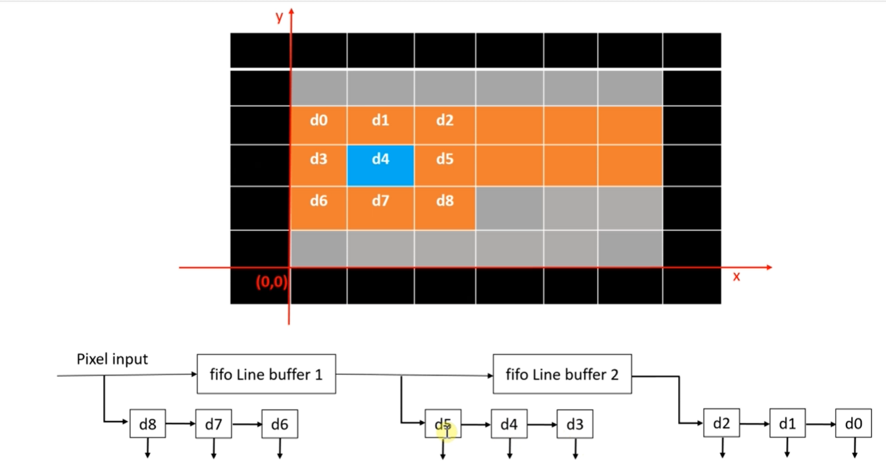
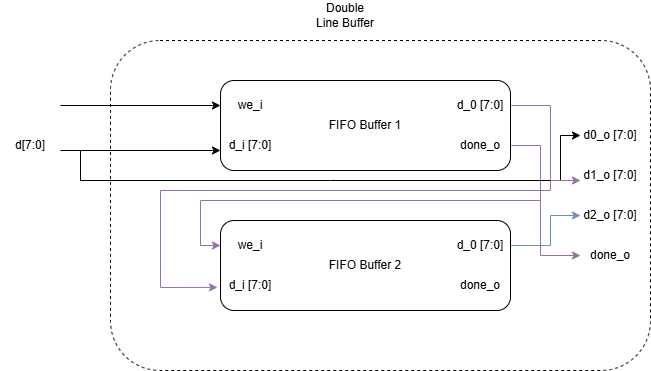
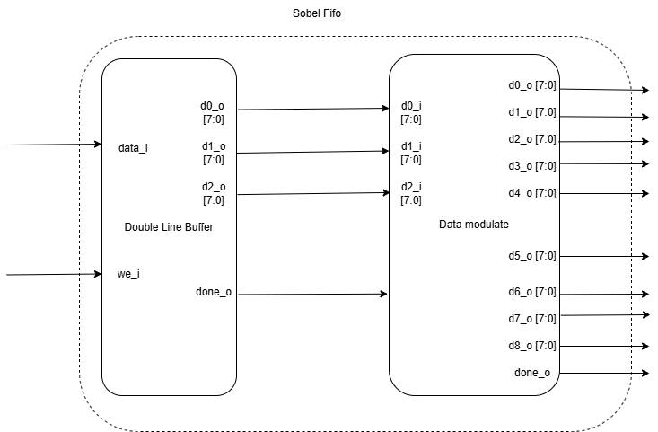
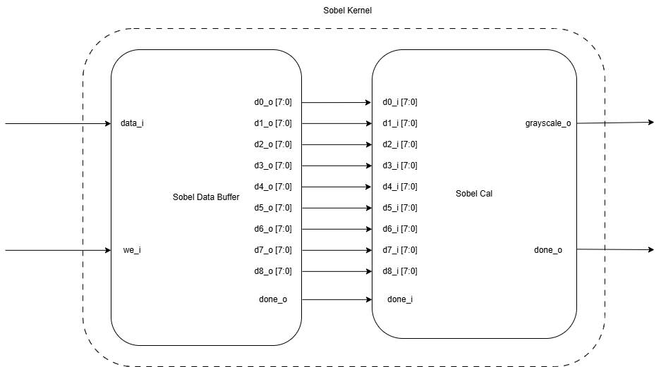

# Sobel Edge Detection

## Top Level Design

.png)

### RGB to Grayscale

Grayscale = 0.299 * R + 0.587 * G + 0.114 * Y

Y = 0.3 * R + 0.59 * G + 0.11 * B

~ Y = 0.28125 * R + G * 0.5625 + B * 0.09375

$Y = R *((1/2)^2  + (1/5)^2) + G * ((1/2) + (1 / 2)^4) + B * ((1 /2 ^4) + (1/2) ^5 )$

→ Y = (R >> 2) + (R >> 5) + (G >> 1) + (G >> 4) + (B >> 4) + (B >> 5)

## Sobel Kernel Design

### Double Line Buffer

### Sobel fifo (sobel buffer)

### Sobel Data Modulate Case

- Row = 0 and Col = 0

- Row = 0 and Col ≠ 0 and < Max Col - 1

- Row = 0 and Col == Max Col - 1

- Row > 0 and Row < Max Row - 1 and Col = 0

- Row and Col ≠ 0 and < Max → full
- Row > 0 and Row < Max Row  and Col = Max Col - 1

- Row = Max Row - 1 and Col == 0

- Row = Max Row - 1 and Col >0 and Col < Max Col - 1

- Row = Max Row - 1 and Col = Max Col - 1

## Sobel Calculation

We have 

- Gx_p = f(x  - 1, y - 1) + 2 * f(x - 1, y ) + f(x - 1, y +1)
- Gx_n = f(x + 1, y - 1) + 2 * f(x + 1, y) + f(x + 1, y - 1)
- Gx_d = Gx_p - Gx_n

Same for Gy

We can pipeline as following:

