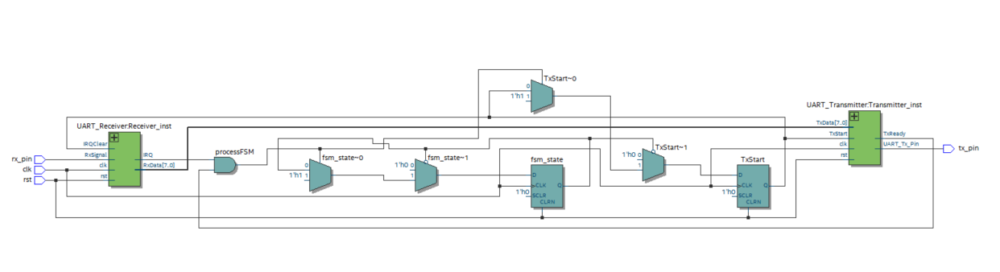

# UART Modules

# Top Level

Top level hay nói cách khác là module UART dạng Blackbox, biết đầu vào và đầu ra mong muốn của UART.

| Chân | IO | Kiểu dữ liệu | Chi tiết |
| --- | --- | --- | --- |
| rst | in | std_logic | reset |
| clk | in | std_logic | clock |
| rx_pin | in | std_logic | chân dữ liệu receive |
| tx_pin | out | std_logic | chân dữ liệu transmit |

Trong module UART sẽ bao gồm 2 module con là Transmitter và Receiver.

Dưới đây là RTL View của module UART.

## Baud rate clock generator

Module này sẽ tính toán ra baud rate theo clock của hệ thống và baud rate mong muốn, từ đó để việc đồng bộ dữ liệu được đảm bảo.

| Chân | IO | Kiểu dữ liệu | Chi tiết |
| --- | --- | --- | --- |
| rst | in | std_logic | reset |
| clk | in | std_logic | clock |
| start | in | std_logic | dấu hiệu bắt đầu việc gen baud clk |
| baudClk | out | std_logic | baud clk lối ra |
| ready | out | std_logic | ready = ‘1’ khi đã gen hết toàn bộ số lượng clocks, ngược lại khi đang gen thì ready = ‘0’ |

## Serialiser

Nhận dữ liệu đầu vào song song và trả dữ liệu thành dạng serial data stream. 

| Chân | IO | Kiểu dữ liệu | Chi tiết |
| --- | --- | --- | --- |
| rst | in | std_logic | reset |
| clk | in | std_logic | clock |
| shiftEn | in | std_logic | shiftEn = ‘1’ cho phép dịch dữ liệu sang phải (shift right) |
| Load | in | std_logic | load = ‘1’ ⇒ SR = Din |
| Din | in | std_logic_vector | dữ liệu vector đầu vào |
| Dout | out | std_logic | đầu ra |

## Shift Register

| Chân | IO | Kiểu dữ liệu | Chi tiết |
| --- | --- | --- | --- |
| rst | in | std_logic | reset |
| clk | in | std_logic | clock |
| shiftEn | in | std_logic | shiftEn = ‘1’ cho phép dịch dữ liệu sang phải (shift right) hoặc sang trái (shift lèt) |
| Din | in | std_logic | dữ liệu đầu vào |
| Dout | out | std_logic_vector | đầu ra vector |

## Synchronizer

2-stage synchronizer

| Chân | IO | Kiểu dữ liệu | Chi tiết |
| --- | --- | --- | --- |
| rst | in | std_logic | reset |
| clk | in | std_logic | clock |
| async | in | std_logic |  |
| synced | out | std_logic |  |
